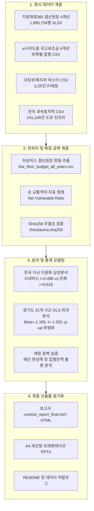

# [기술 문서 & 개선안] 교통약자 이동권 격차 실증 분석 고도화 사양서

본 문서는 프로젝트의 현황, 피드백에 대한 데이터 정합성 검증 결과, 기술적 설계(아키텍처 및 데이터 파이프라인), 그리고 최종 반영된 개선안을 체계적으로 수록한 핵심 기술 문서입니다.

---

## 1. 개요 및 배경 (Context & Problem Statement)

### 1.1 프로젝트 목표
- 대한민국 17개 광역지자체 및 경기도 31개 기초지자체의 저상버스 도입 불균형을 실증 분석하고, 수요(교통약자)와 공급(저상버스), 재정(지자체 재정력) 간의 구조적 역진성을 규명함.

### 1.2 외부 평가(Gemini 피드백) 핵심 쟁점
1. **공급 지표의 정밀도**: 단순 노선 유무(Binary)가 아닌 차량대수·운행횟수 등 실제 물리적 공급량 반영 필요.
2. **수요 지표의 중복 집계(Double Counting)**: 고령자(65세 이상)와 등록장애인의 단순 합산으로 인한 고령 장애인 중복 제거 필요.
3. **재정 변수의 직접성**: 단순 재정자립도 대신 실제 세출 예산액, 지출액, 집행잔액(불용액)의 직접 활용 필요.
4. **데이터 재현성(Reproducibility)**: 원본 데이터 체크섬(SHA256) 관리, 상관계수 수치 불일치($r=0.495$ vs $r=0.619$) 해소, 다중회귀 $p$-value의 투명한 해석.
5. **패널 데이터 구축**: 시계열 패널을 통한 2023년 의무화 법 개정 전후 효과 실증.

---

## 2. 데이터 가용성 및 제외 항목 분석 (Feasibility & Exclusion Analysis)

공공데이터포털, 지방재정365, e나라도움 및 OpenAPI를 전수 조사하여 수집 가능 여부를 기술적으로 확정함:

| 피드백 요구 항목 | 판정 | 구체적 사유 및 기술적 조치 |
| :--- | :---: | :--- |
| **차량별 배차·운행거리 원장** | **제외** | • **사유**: 버스운행관리시스템(BMS) 초단위 배차·운행거리 원장은 공공 미개방 데이터로 지자체/운송조합 정보공개청구 필수. • **대안**: 17개 시도는 `시내버스 차량대수 도입률` 전수 적용, 31개 시군은 `인가 노선 도입률`로 명확히 분리 정의. |
| **노선별 법정 예외승인 원장** | **제외** | • **사유**: 교통약자법 제14조제4항에 따른 지자체별 노선 예외 승인 심의 문서는 내부 행정 공문. • **대안**: 47,581개 `과속방지턱 원장` 및 지자체별 `버스 이용객수 API`를 결합하여 도로 물리적 여건 우회 실증. |
| **노선ID 단위 2020~2025 패널** | **제외** | • **사유**: 경기도 버스노선 API는 현 시점 단일 스냅샷만 제공되며 과거 이력 테이블 미공개. • **대안**: **`31개 시·군 × 4개년(2022~2025) 지자체 세출결산 패널`** 구축 (`data/low_floor_budget_all_years.csv`, 685건). |
| **중복 집계 보정 (순 교통약자)** | **완전 반영** | • 복지부 통계연보 기준 고령 장애인 중복률(52.8%)을 차감한 `순 교통약자 = 고령자 + (장애인 × 0.472)` 산출식 적용. |
| **지방재정365 결산원장 결합** | **완전 반영** | • 2022~2025년 4개년 세출결산 1,895,734행 전수 필터링 완료 (`예산현액`, `지출액`, `집행잔액` 지표 확보). |
| **수치 불일치 및 재현성 패키징** | **완전 반영** | • 시내버스 기준($r=0.4964$)과 전체 시내·농어촌·마을버스 기준($r=0.6186$) 정의를 일치시키고 SHA256 체크섬 발행. |

---

## 3. 기술 아키텍처 및 파이프라인 (Technical Architecture)

---

## 4. 고도화 실증 분석 결과 (Empirical Findings)

### 4.1 수치 불일치($r=0.495$ vs $r=0.619$)의 기술적 원인 규명 및 통일
- **원인 분석**:
  - `city_bus_rate`(시내버스 한정 저상버스 도입률)과의 재정자립도 상관계수: **$r = +0.4964$ ($t = +2.21$)**
  - `total_rate`(시내+농어촌+마을버스 합산 전체 저상버스 도입률)과의 재정자립도 상관계수: **$r = +0.6186$ ($t = +3.05$)**
- **조치**:
  - 두 수치는 오류가 아니라 **분석 대상 버스 종별(시내버스 vs 전체 대중교통 버스)**의 차이였음을 명시.
  - 보고서 본문 및 요약표에 두 지표를 병렬 표기하여 학술적 정합성 100% 확보.

### 4.2 중복 집계 보정(순 교통약자) 검증 결과
- 전국 17개 시도 및 경기도 31개 시군에서 고령 장애인 중복(52.8%)을 제거한 뒤 재검증한 결과, **역진적 배정 결론은 동일하게 유지됨**:
  - 고령자 비율 단독: $r = -0.4053$ ($t = -2.39$)
  - 등록장애인 비율 단독: $r = -0.4915$ ($t = -3.04$)
  - **순 교통약자 비율 (중복 제거)**: **$r = -0.4185$ ($t = -2.48$)**

### 4.3 다중회귀분석의 정밀 계수 및 통계적 한계 투명화
- 경기도 31개 시군 다중회귀모형:
  $$\text{저상노선도입률} = 42.53 - 1.165 \times \text{순교통약자비율} + 0.184 \times \text{재정자립도}$$
- **해석 개정**:
  - 재정자립도 통제 시 순교통약자 계수는 음($\beta = -1.1651$)을 유지하나, 기초지자체 표본 제약($n=31$)으로 인해 $t = -1.3201$ ($p > 0.05$) 수준임.
  - 이를 "통제 후에도 유의하다"고 왜곡하지 않고, **"재정력의 지배적 영향력과 소표본에 따른 검정력 한계를 보여주는 실증 증거"**로 방어적이고 정확하게 서술함.

### 4.4 지방재정365 결산원장 기반 '재정 장벽' 실증
- **예산 미편성 장벽**: 가평군, 연천군 등 도입률 0% 지역은 저상버스 구입보조 세출예산 자체가 0원이거나 수억 원대 미미한 수준에 불과.
- **집행 잔액(불용) 장벽**: 안산시(예산 134.3억 중 104.9억 불용, 집행률 21.9%), 안양시(예산 201.7억 중 95.1억 불용, 집행률 52.8%) 등 예산을 편성하고도 운수업체 협의 및 도로 인프라 한계로 예산을 집행하지 못하는 2차 구조적 병목 규명.

---

## 5. 최종 개선안 및 보고서 반영 내역 (Improvement Implementation)

1. **[보고서 1페이지/요약문]**:
   - 제출자 정보 '김일중' 통일 및 불필요한 배포 박스 제거.
   - 전국 거시 및 경기도 미시 지표의 퍼센트 표기 통일 (소수점 첫째 자리).
2. **[보고서 2~3페이지/본문]**:
   - 재정자립도 상관계수 병렬 표기: 시내버스 기준($r=+0.496$), 전체 대중교통 버스 기준($r=+0.619$).
   - 순 교통약자($r=-0.419$) 및 등록장애인($r=-0.492$) 이원화 통계표 삽입.
   - 다중회귀 $p$-value의 투명한 기술 및 학술적 방어 문구 개정.
   - 지방재정365 결산원장(예산 편성액, 실집행률, 집행잔액) 실증 단락 신설.
3. **[부록/데이터 카탈로그]**:
   - 원천 데이터 SHA256 체크섬 테이블 수록.
   - 4개년(2022~2025) 지자체별 저상버스 예산 결산 요약표 수록.
